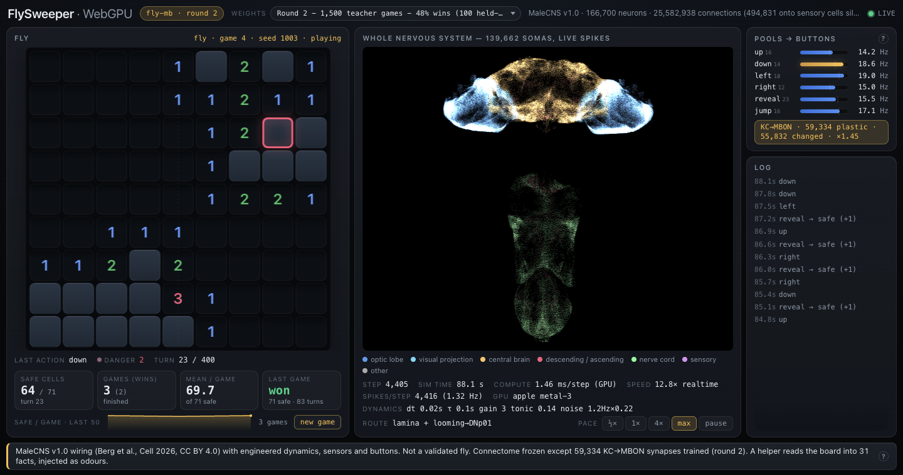
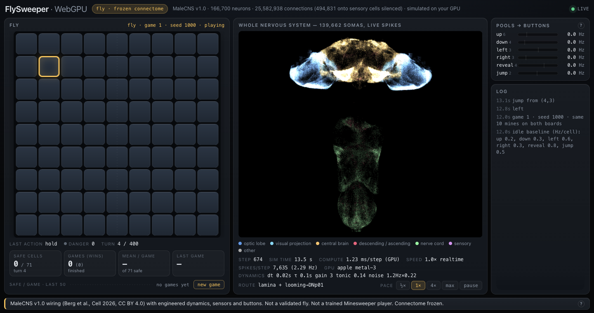
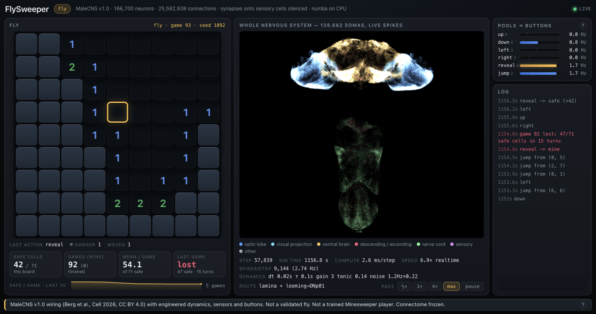
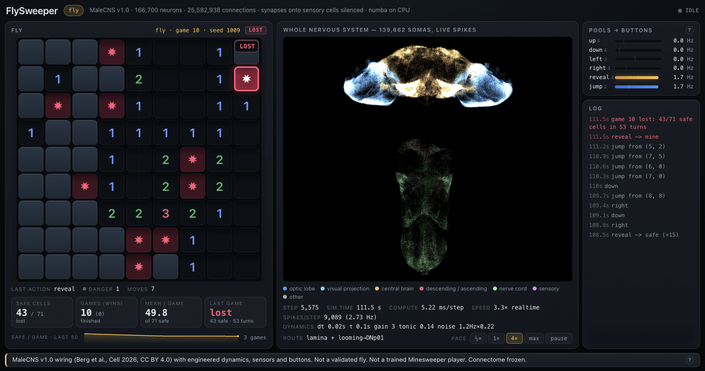
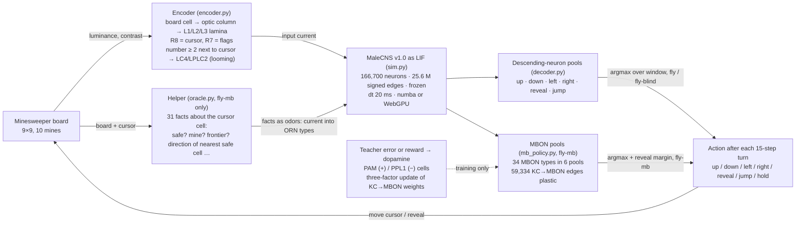

# FlySweeper

**The complete MaleCNS v1.0 fruit-fly connectome, simulated as 166,700 spiking neurons, wired to
Minesweeper.**

FlySweeper takes the released wiring of the *Drosophila* male central nervous system
(Berg et al., Cell 2026, CC BY 4.0: 166,700 neurons, 25,582,938 directed connections,
124,177,617 synapses), runs it as a leaky integrate-and-fire network — in Python/numba at 1.3 ms
per 20 ms brain step, or entirely in your browser on WebGPU at 0.88 ms per step — and gives it a
9×9 Minesweeper board with 10 mines. The board is painted onto the fly's lamina by optic column, six
groups of real descending neurons are read as buttons, and a hand-built "looming" channel makes the
real giant-fiber escape pathway fire the *jump* button. Left alone, the frozen connectome is a
random player (0 wins in every held-out evaluation, ~51 of 71 safe cells, the same as a
coin-flipping random walk). A second version (`fly-mb`) lets a helper read the board into 31 facts, injects them as
odors through real olfactory receptor neurons, and trains **only** the Kenyon-cell → mushroom-body
output synapses with a three-factor rule; after three training rounds it wins **76 of 100** held-out
games (the helper's facts read by a fixed rule win 84; the frozen fly wins 0). Everything that is
invented rather than anatomical is listed below, twice. Nothing here is a
validated fly, and the fly does not understand Minesweeper — a helper does the spatial inference
and the mushroom body learns which of six actions each set of facts calls for.

> MaleCNS v1.0 wiring (Berg et al., Cell 2026, CC BY 4.0) with engineered dynamics, sensors and
> buttons. Not a validated fly. Not a trained Minesweeper player. Connectome frozen.
> — the label at the bottom of both user interfaces

## See it run

* **Browser (WebGPU):** the whole connectome simulated on your GPU, served from your own machine
  in two commands (see [Quickstart](#quickstart)) — [`web/`](web/)
  ([how it works and how it was verified](web/README.md)). Needs Chrome 113+ or Edge (WebGPU on
  by default); loads 205 MB of wiring once, then cached. The trained weight sets ship with the page
  (`web/weights/`) and a **weights** selector in the header switches between round 1, round 2 and
  round 3 — **round 3 is the default**; `?weights=frozen` runs the untrained connectome. A session
  is 100 finished games; the simulation then stops behind a summary card with a **Restart session**
  button (`?games=N` changes the length). Hosting it publicly is optional and covered in
  [`docs/deploy.md`](docs/deploy.md).
* **Python spectator:** `python -m flysweeper.server --condition fly-mb` serves a live page on
  `http://127.0.0.1:8765/` where the trained fly plays forever and every spike of the 139,662
  plotted somas is drawn.

| WebGPU page, trained fly (`fly-mb`, round-2 weights selected; 2 wins in 3 games) | WebGPU page, frozen fly |
|---|---|
|  |  |
| **Python spectator, frozen fly** | **A lost game** (Python spectator; mines burst, cursor ring turns red) |
|  |  |

The win rendering (remaining cells flip to flags under a gold pulse) is in
[`docs/img/flysweeper-won.png`](docs/img/flysweeper-won.png); that capture was triggered with the
debug `flysweeper.forceWin()`, not played.

Left panel: the fly's board, gold square = cursor (red when the looming channel is active). Centre:
the whole nervous system, brain on top, nerve cord below, one glow per spike. Right: the six
action pools as firing rates over the 15-step decision window, and the log.

## What is anatomy and what we invented

| piece | anatomy (from MaleCNS v1.0) | invented (ours or borrowed from the community, credited below) |
|---|---|---|
| neurons, synapse counts, cell types, sides, superclasses, soma positions, optic-lobe hex columns | yes | — |
| synapse sign | transmitter prediction per presynaptic cell | GABA / glutamate / histamine → −1, everything else → +1; receptor effects ignored; weights normalized so each cell's total absolute input is 1 (Fly64 / fly.ai convention) |
| dynamics | — | LIF cartoon: `v ← v·e^(−dt/τ) + gain·Σ w·spike + tonic + noise`, dt 20 ms, τ 100 ms, gain 3.0, tonic 0.14, Bernoulli noise 1.2 Hz × 0.22, threshold 1, reset 0 (Fly64 model, fly.ai preset) |
| synapses onto sensory neurons | 494,831 real edges | **removed** in every condition, so sensory cells are driven only by our input (Shiu et al. 2024 convention, fly.ai fix) |
| board → eye | L1/L2/L3 lamina cells, R7, R8 and their hex columns are real | which column sees which board cell (equal-count partition, left eye = left half), the luminance table, the 25 Hz cursor flicker, Fly64's retinal drive formula; injecting into the lamina at all (the photoreceptor route is implemented but the image dies at the histamine relay — measured in `probe.py`) |
| looming / jump | LC4 / LPLC2 → giant fiber DNp01 is real wiring and does fire from the wiring alone | painting "a revealed number ≥ 2 next to the cursor" as a looming object onto LC4/LPLC2; reading DNp01 as *jump* |
| buttons (`fly`) | the descending-neuron types are real | which type is which action: up DNp09+DNg100+DNg97, down MDN, left/right DNa02+DNa11+DNg13 by side, reveal DNpe017+DNp10, jump DNp01; the 15-step window, running baseline, argmax, hold |
| helper facts (`fly-mb`) | ORN cells and their glomerular wiring are real | the helper itself (ordinary single-point Minesweeper logic, `oracle.py`), the 31 facts, which fact drives which ORN type(s) (49 of the 53 ORN types in round 3), the amplitude |
| decision (`fly-mb`) | the MBON cells and their Kenyon-cell inputs are real | which MBON types form which of the six pools (34 types, 91 cells), centred pool scores, argmax, the reveal mask (reveal not selectable on a cell the helper already knows is revealed or a mine; round 3), the reveal margin (0.25 in round 2, 0 in round 3) |
| learning (`fly-mb`) | KC→MBON synapses are where flies store associative memories; PAM / PPL1 are the real dopamine cells | the rule (perceptron-style three-factor update with a dopamine pulse marking each teaching event), the rewards, learning rate, clip range, the teacher |
| mushroom-body tuning (`fly-mb` only) | — | KC→KC synapses silenced (642,933 edges), KC bias −0.3, PN bias −0.3, PN→KC gain 3: without this every Kenyon cell fires on every step and there is no odor code; reverted for every other condition |
| the game | — | Minesweeper 9×9 / 10 mines, six actions per 15-step turn, 400-turn limit, both UIs |

Nothing else changes. Every synapse outside the 59,334 trained KC→MBON edges keeps its connectome
value in every condition, and the trained edges are stored with their original values so the
change is auditable (`models/`).

## How the loop works



One turn = 15 brain steps = 300 ms of simulated time. The board is re-painted every step; the
pools are counted over the window; one action is taken; the board changes; repeat. In `fly-mb` the
visual input stays on and the helper's facts are added as odors; in `fly-blind` the screen is
black; in `random-walk` the brain is replaced by a coin flip over the same six actions.

Conditions (`flysweeper/agent.py`): `fly`, `fly-blind`, `fly-readout`, `fly-learning`, `fly-mb`,
`fly-mb-oracle-only`, `random-walk`, `random-click`, `solver`.

## Results

All numbers are from held-out seeds that were never used for training (training seeds are
≥ 10000), with exploration off, the same boards for every condition in a table. "Safe cells" is the
mean number of the 71 safe cells revealed per game ± SEM. Raw reports: [`docs/results/`](docs/results/README.md).

### Held-out games, 9×9 / 10 mines

| condition | what it is | seeds 5000–5029 (30 games): wins · safe cells | seeds 5000–5099 (100 games): wins · safe cells · turns |
|---|---|---|---|
| solver | single-point logic + random guesses when stuck; no brain | 27/30 (0.90) · 68.8 ± 2.0 | 86/100 (0.86) · 69.6 ± 0.7 · 25 |
| fly-mb-oracle-only | the helper's 31 facts read by a fixed hand-written rule; no brain (the ceiling of the facts) | 26/30 (0.87) · 70.4 ± 0.4 | 84/100 (0.84) · 68.9 ± 0.9 · 51 |
| **fly-mb (round 3, current release)** | trained KC→MBON synapses, decision by the MBON pools; reveal mask, margin 0 | **25/30 (0.83) · 69.0 ± 1.3** (margin 0.25) | **76/100 (0.76) · 67.6 ± 0.9 · 66** |
| fly-mb (round 2, previous release) | same pools, round-2 odor map, reveal margin 0.25 | 18/30 (0.60) · 67.1 ± 1.8 | 60/100 (0.60) · 66.8 ± 0.9 · 71 — same run as the round-3 row; 48/100 · 66.7 ± 0.8 in an earlier run (see note) |
| fly | frozen connectome, descending-neuron pools | 0/30 · 51.3 ± 2.3 | 0/100 · 51.7 ± 1.3 · 43 |
| random-walk | same six actions, brain replaced by coin flips | 0/30 · 50.4 ± 2.5 | 0/100 · 50.1 ± 1.4 · 50 |
| fly-blind | frozen connectome, black screen | 0/30 · 44.5 ± 2.5 | 0/100 · 49.6 ± 1.3 · 33 |
| random-click | reveal a uniformly random hidden cell each turn | 0/30 · 39.3 ± 2.8 | 0/100 · 41.1 ± 1.7 · 4 |
| fly-readout (A) | frozen connectome + trained linear readout of 13,562 cells (approach A) | 0/30 · 48.1 ± 2.3 | — |
| fly-mb (round 1) | 200 teacher-driven warm-start games | 0/30 · 46.9 ± 2.0 | — |
| fly-learning | the original dopamine rule in `plasticity.py` (seeds 6000–6029) | 0/30 · 50.2 ± 2.4 | — |

The 100-game column is one run (`docs/results/validation/mb_round3/`; the round-3 row was run on
the same seeds in a separate process, `mb_round3_teacher500/`). Quote **0.76 ± 0.04** (binomial SE
on 100 games) as the trained fly's win rate. Caveat: the round-2 weights scored 48/100 and 60/100
on the *same* boards in two runs that differed only in the Numba thread count (a different
Bernoulli noise stream), so game-level variance across noise realisations is larger than the
binomial bar; the paired 16-point gap between round 3 and round 2 in one run is the robust number.
An RL fine-tune of the round-3 checkpoint with the redesigned rewards also reached 76/100 but at
107 turns per game instead of 66, so the teacher-only checkpoint is the one installed. On easier
boards the round-2 policy wins 24/30 (6×6, 3 mines) and 21/30 (6×6, 4 mines); round 3 was not
re-run on 6×6.

### Training progression (`fly-mb`)

| round | trained on | plastic edges | teacher agreement (argmax, 600 teacher-driven turns) | bad-click rate (a reveal where the teacher would not reveal) | held-out wins 30 / 100 seeds | safe cells |
|---|---|---|---|---|---|---|
| 1 | 300 teacher-driven games then RL (checkpoint at 200); 6 single-type MBON pools; dense KC code; weights in [0.1, 5]×w0 | 16,167 | 0.484 (chance 0.17) | ≈ 12 % | 0/30 · — | 46.9 |
| 2 | 1,500 teacher-driven games, perceptron rule, 34 MBON types in 6 pools, floor 0, sparse KC code, reveal margin 0.25 | 59,334 | 0.735 (0.722 with the margin) | 0.7 % (0.2 % with the margin) | 18/30 · 48/100 | 67.1 · 66.7 |
| **3** | the round-2 weights continued for 500 teacher-driven games (2,000 in total); a second ORN type for each of the 8 graded direction channels (49 of 53 ORN types used); perceptron rule with argmax decisions, move-vs-move errors weighted 2×; reveal mask; margin 0 | 59,334 | **0.763** | **0.000** (reveal false-positive rate) | **25/30 · 76/100** | **69.0 · 67.6** |

The round-3 30-seed numbers (agreement, false-positive rate, 25/30, 69.0) were measured with the
reveal margin at 0.25; the installed file has margin 0 and the 100-seed row is at margin 0.

What moved the needle, in order (details and every intermediate run in
[`docs/training.md`](docs/training.md)): a discriminative Kenyon-cell code (with the raw wiring
every KC fires on every step, odor or not), bigger MBON pools with a silent-synapse floor, the
perceptron-style error rule instead of an every-turn teacher rule, the reveal margin, and in
round 3 the strengthened direction channels — the control that kept the round-2 odor map and
trained for the same extra games got *worse* (16/30), the level-2 map reached 25/30 at 500 games.
Pure reward-driven RL in round 1 was indistinguishable from a shuffled-reward control; the reason,
measured in round 3, is that the round-1 reward made a blind guess worth about as much as a proven
safe reveal (mean −0.07 vs +0.1 to +0.3 on 324 realistic states), so
[the reward was redesigned](docs/rl_references.md) to penalise unproven reveals even when they
succeed (−0.50 vs +0.3). Fine-tuning the round-3 checkpoint with that reward kept the reveal
false-positive rate at 0.000 and matched the teacher checkpoint on wins (76/100), but made the fly
slower (107 turns vs 66) and a worse imitator (agreement 0.64 vs 0.76); movement, not reveal
discipline, is the remaining gap.

## Quickstart

Everything runs locally: the Python simulator, the spectator page and the WebGPU app are all served
from your own machine. Python 3.11 (the venv used throughout), 16 GB of RAM, and a 1.1 GB download.

```bash
git clone https://github.com/ASHR12/FlySweeper && cd FlySweeper
python3.11 -m venv .venv && ./.venv/bin/pip install -r requirements.txt

# 1. prepare: download the three MaleCNS v1.0 flat tables into data/raw/ and verify their SHA-256
./.venv/bin/python -m flysweeper.prepare

# 2. compile: tables -> data/compiled/ (graph.npz, neurons.feather, eye.npz, meta.json), ~20 s
./.venv/bin/python -m flysweeper.compile_graph

# 3. probe: idle calibration, and does the board reach the descending neurons?
./.venv/bin/python -m flysweeper.sim --preset flyai --steps 500
./.venv/bin/python -m flysweeper.probe

# 4. validate: the frozen fly against its controls on held-out seeds (writes outputs/validation/.../report.md)
NUMBA_NUM_THREADS=8 ./.venv/bin/python -m flysweeper.validate --games 30 --seed0 5000 \
    --conditions fly fly-blind random-walk random-click solver

# 5. the trained fly: install the round-3 weights, validate, then watch it play
scripts/install_weights.sh round3                      # models/mb_weights_round3.npz -> data/compiled/mb_weights.npz (round2 / round1 also available)
NUMBA_NUM_THREADS=8 ./.venv/bin/python -m flysweeper.validate --games 30 --seed0 5000 \
    --conditions fly-mb fly-mb-oracle-only random-walk
./.venv/bin/python -m flysweeper.server --condition fly-mb   # open http://127.0.0.1:8765/  (--condition fly for the frozen fly, --speed 0 for max)
```

Browser version, also local (needs step 2; Chrome 113+ or Edge):

```bash
./.venv/bin/python -m flysweeper.export_web                              # data/compiled -> web/data/ (~205 MB, ~8 s)
./.venv/bin/python -m http.server 8780 --directory web --bind 127.0.0.1  # WebGPU needs localhost or https
open http://127.0.0.1:8780/                                              # ?speed=0 for max, ?human=1 to play the same mines
```

The page opens with the round-3 weights; the **weights** selector in the header switches to round 2,
round 1 or the frozen connectome (`?weights=round2|round1|frozen`). After 100 finished games the
simulation stops behind a summary card — **Restart session** starts over with a fresh brain
(`?games=N` for a different session length, `?games=0` to run forever). Putting the page on a
public host (Vercel / GitHub Pages, with the 205 MB of wiring on a CORS-enabled bucket) is optional
and described in [`docs/deploy.md`](docs/deploy.md).

Training and evaluation commands for every run are in [`docs/training.md`](docs/training.md) §6
(`flysweeper.train_mb`, `flysweeper.mb_eval`, `flysweeper.train_readout`). Weight files are
described in [`models/README.md`](models/README.md).

## Hardware notes

| | Apple M5 Max (measured) |
|---|---|
| Python / numba simulator, event-driven (only the out-edges of spiking neurons are visited) | **1.3 ms per 20 ms brain step ≈ 15× real time**; ≈ 7,600 spikes/step at 2.3 Hz mean rate; ≈ 0.6 GB resident for the bare simulator |
| WebGPU simulator, one fused gather kernel over all 25.1 M active edges | **0.88 ms GPU time per step** (`flysweeper.benchmark(300)`), 15.8× real time in live play including decisions, readbacks and the brain map; 209 MB of GPU buffers |
| a full game (15 steps/turn, ~75 turns for `fly-mb`) | ≈ 1.5–2 s of compute at full speed |
| a 1,500-game teacher-driven training run (`train_mb`, 4 threads, three runs in parallel) | ≈ 45 min |
| download / compile / export | 1.1 GB from the Janelia bucket · ~20 s to compile · ~8 s to export for the browser |

It runs on 16 GB Macs; the compile step (reading the 1.05 GB weights table with pyarrow/pandas) is
the memory peak. The Bernoulli noise is drawn per numba thread, so `NUMBA_NUM_THREADS` changes
individual games but not the statistics; the WebGPU noise is a stateless hash, so a browser run is
reproducible for a given seed. Linux and Windows are untested (numba and Chrome's WebGPU should
both work).

## Honesty and limits

* **Not a fly.** The wiring is real; the neuron model is a one-compartment LIF cartoon with one
  gain, one time constant and one tonic drive for every cell, transmitter signs without receptor
  identity, and synapses onto sensory neurons removed. Nothing has been fitted to physiology.
* **The frozen fly is a random player.** 0 wins in every held-out evaluation (four 30-game runs on
  two seed sets and two camera settings) and ~49–54 safe cells, the same as a random walk over the
  six actions. `fly` differs from `fly-blind` (51.3 vs 44.5 safe cells),
  so the board does change the output — but not toward playing well. The vision probe shows why: in
  this model the image never reaches the central brain (Kenyon cells, MBONs and central-complex
  cells are at chance for every board quantity), and a linear readout of 33k cells could not
  beat the random walk either (approach A in `docs/training.md`).
* **The trained fly does not see the board's logic.** The helper (`oracle.py`) does the single-point
  inference and the fly receives its 31 conclusions as smells. The fixed-rule ceiling on those same
  facts is 0.84–0.87; the round-3 mushroom body recovers 0.76/0.84 ≈ 90 % of it on wins but takes
  66 turns per game against the rule's 51 and the solver's 25 (movement, not reveal discipline, is
  the gap). Only 59,334 KC→MBON synapses were trained (round 3: 55,907 changed, 2,673 silenced,
  mean ratio 1.68, none at the ceiling).
* **Learning was supervised, through a plausible site.** Teacher errors drive a three-factor update
  with a dopamine pulse marking the event; reward-only learning matched a shuffled-reward control
  in round 1. The redesigned round-3 reward, applied as a fine-tune from the teacher checkpoint, did
  not increase unproven reveals and matched the teacher checkpoint on held-out wins, but it did not
  beat it and made the fly slower — so the installed policy is teacher-trained only. A reward-only
  run from scratch with the new reward was not attempted.
* **Decoder engineering is disclosed and was tuned on training seeds only:** centred pool scores, the
  reveal margin (round 2: without it the same weights win 8/30 instead of 18/30; round 3 installs at
  margin 0), and in round 3 a reveal mask on cells the helper already knows are revealed or mined.
  The mask does not touch hidden unproven cells; refusing those is the pools' own doing.
* **The mushroom body had to be tamed** to carry any odor code (KC→KC silenced, KC/PN biases,
  PN→KC gain); the resulting code is discriminative but denser (65 % of KCs active per window) than
  a real sparse KC code. These changes apply only in `fly-mb`; the `fly` rows are run with the
  original wiring in the same process.
* **Two of the sensors are invented stimuli on real pathways**: the lamina injection (because the
  photoreceptor → histamine relay does not carry the image in this model) and the looming object
  painted onto LC4/LPLC2. The escape reflex the second one triggers is anatomy; the reason it
  fires is not.
* **A live-server bug** (the softmax temperature left at 1.0 in the spectator path after the round-2
  install) made the spectator play near-randomly for a while; it was fixed and the server was
  verified to reproduce `validate.py`'s action traces bit-for-bit.
* One dataset, one dynamics preset, one board size for the headline numbers; 30- and 100-game
  estimates carry the binomial error bars quoted above.

## Weight sets and versioning

Trained policies are versioned as whole files in [`models/`](models/README.md): one `.npz` per
round, never overwritten, each carrying the trained KC→MBON values, the original connectome values
of the same edges, the pools, the odor map, the KC settings, the reveal margin and mask, plus a
SHA-256 in `models/SHA256SUMS`. `scripts/install_weights.sh roundN` copies one into
`data/compiled/mb_weights.npz`, which is what `fly-mb`, the spectator and `validate.py` load by
default. Round 1 (`mb_weights_round1.npz`, 0 wins), round 2 (`mb_weights_round2.npz`, 48–60/100)
and round 3 (`mb_weights_round3.npz`, 76/100, the current release and the default in the web app)
are included. The browser build carries the same sets converted to JSON + binary in `web/weights/`.

## Repository layout

| path | what |
|---|---|
| `flysweeper/` | the Python package: `prepare` (download), `compile_graph`, `sim` (numba LIF), `encoder`, `decoder`, `oracle`, `mb_policy`, `plasticity`, `agent` (conditions), `teacher`, `train_mb`, `mb_eval`, `train_readout`, `validate`, `probe`, `server` + `ui/index.html`, `export_web` |
| `web/` | the WebGPU app (vanilla JS + WGSL, no build step) — [`web/README.md`](web/README.md) |
| `docs/` | [`training.md`](docs/training.md) (everything tried, all numbers), [`rl_references.md`](docs/rl_references.md), [`deploy.md`](docs/deploy.md), [`results/`](docs/results/README.md), `img/` |
| `models/` | trained weight sets and their provenance |
| `scripts/` | `install_weights.sh` |
| `data/` (gitignored) | `raw/` MaleCNS tables, `compiled/` graph, `compiled/mb_weights.npz` |
| `outputs/` (gitignored) | training runs, validation reports, screenshots |
| `LICENSE`, `DATA-LICENSE.md`, `CITATION.cff` | MIT for the code; CC BY 4.0 attribution for the data and derived weights; how to cite |

## Credits and citations

**Data:** Berg et al. 2026 (CC BY 4.0) — Berg, S. et al., *Sexual dimorphism in the complete
connectome of the Drosophila male central nervous system*, **Cell** 2026,
[doi:10.1016/j.cell.2026.08.015](https://doi.org/10.1016/j.cell.2026.08.015); MaleCNS v1.0 via
[male-cns.janelia.org](https://male-cns.janelia.org/). Attribution requirements: [`DATA-LICENSE.md`](DATA-LICENSE.md).

**Science:** Shiu et al. Nature 2024 (whole-brain LIF, sign convention, sensory-input removal) —
[doi:10.1038/s41586-024-07763-9](https://doi.org/10.1038/s41586-024-07763-9); von Reyn 2014 /
Ache 2019 (looming → giant fiber) — [von Reyn et al., Nat. Neurosci. 2014](https://doi.org/10.1038/nn.3741),
[Ache et al., Curr. Biol. 2019](https://doi.org/10.1016/j.cub.2019.01.079); Aso 2014 / Hige 2015
(MB output neurons, dopamine plasticity) — [Aso et al., eLife 2014](https://doi.org/10.7554/eLife.04577),
[Hige et al., Neuron 2015](https://doi.org/10.1016/j.neuron.2015.11.003).

**Community engineering:** Fly64 by Jessica Paquette (20 ms LIF cartoon, normalized weights,
Bernoulli noise, retinal drive formula) [github.com/ornata/fly](https://github.com/ornata/fly);
fly.ai by alextitonis (tonic 0.14/gain 3.0, sensory-input fix, frozen-brain+trained-readout framing)
[github.com/alextitonis/fly.ai](https://github.com/alextitonis/fly.ai); DOOMFLY by Alex Wormuth
(photoreceptor→column mapping via hex-annotated lamina targets, DNpe017 button, PPL1/PAM dopamine
poke) [github.com/nftechie/doomfly](https://github.com/nftechie/doomfly); Xenova's Neural Canvas
(descending-neuron readout groups)
[huggingface.co/spaces/Xenova/fruit-fly-simulation](https://huggingface.co/spaces/Xenova/fruit-fly-simulation);
Ramp Labs "Fly Review" (train only KC→MBON synapses; helper model digests input into channels)
[labs.ramp.com/fly-review](https://labs.ramp.com/fly-review); blendi-remade fly-brain-minecraft
(hand-built looming stimulus precedent); FLYBRAIN (independent precedent for injecting the screen
into L1/L2).

**Methods:** three-factor / reward-modulated Hebbian learning (Izhikevich 2007 —
[doi:10.1093/cercor/bhl152](https://doi.org/10.1093/cercor/bhl152); Frémaux & Gerstner 2016 —
[doi:10.3389/fncir.2015.00085](https://doi.org/10.3389/fncir.2015.00085)), perceptron rule
(Rosenblatt 1958 — [doi:10.1037/h0042519](https://doi.org/10.1037/h0042519)), reservoir computing
(Jaeger 2001 — [GMD Report 148](https://www.ai.rug.nl/minds/uploads/EchoStatesTechRep.pdf);
Maass 2002 — [doi:10.1162/089976602760407955](https://doi.org/10.1162/089976602760407955));
reward design from
[sdlee94/Minesweeper-AI-Reinforcement-Learning](https://github.com/sdlee94/Minesweeper-AI-Reinforcement-Learning)
(guess −0.3, progress +0.3), Wang & Lei 2025 Applied Sciences 15(5):2490 (guess penalty,
supervised-first) — [doi:10.3390/app15052490](https://doi.org/10.3390/app15052490),
[science-buddies/reinforcement_learning_minesweeper](https://github.com/science-buddies/reinforcement_learning_minesweeper)
(3×3 safe opening). Review of what transferred: [`docs/rl_references.md`](docs/rl_references.md).

**Ours (no credit owed):** all code, the Minesweeper task, the lamina input route, equal-count eye
partition, oracle-facts-as-odors for a game, 34-MBON pooled readout with perceptron rule, sparse KC
settings, reveal margin, validation harness, both UIs, the finding that the round-1 reward made
guessing profitable.

To cite this repository use [`CITATION.cff`](CITATION.cff) (GitHub's "Cite this repository"
button); please cite Berg et al. 2026 alongside it whenever the wiring is involved.

## License

Code, documentation and user interfaces: [MIT](LICENSE), © 2026 Ashutosh Shrivastava.
The connectome is MaleCNS v1.0 by Berg et al. (Cell 2026), licensed
[CC BY 4.0](https://creativecommons.org/licenses/by/4.0/); this repository redistributes derived
weight files only, never the source tables, and [`DATA-LICENSE.md`](DATA-LICENSE.md) states the
attribution that must travel with them.
